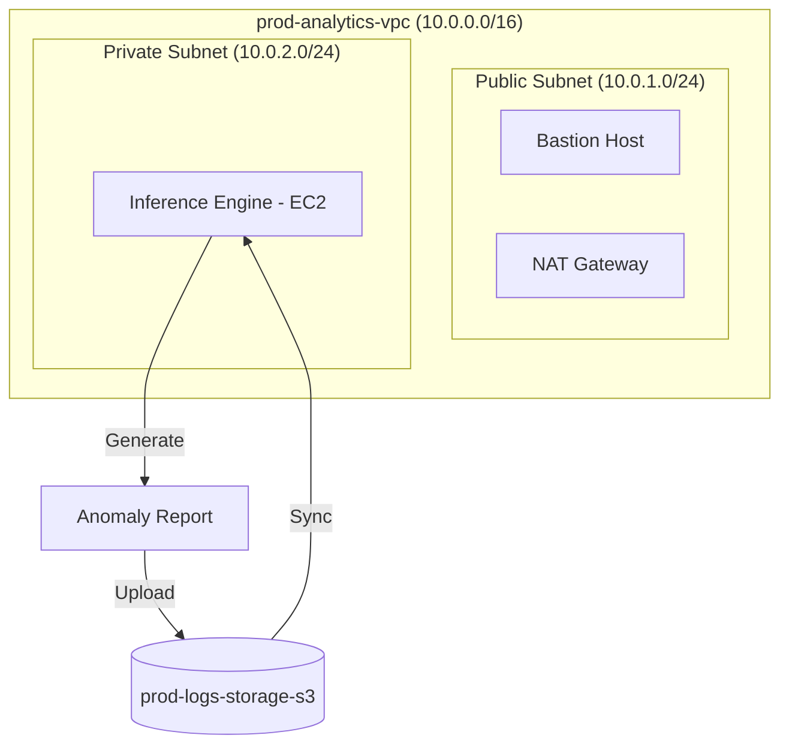

# AI-Powered Log Anomaly Detection System

A production-level AWS Cloud + AI project demonstrating advanced VPC architecture, secure log management, and machine learning for proactive threat detection.

## 🚀 Project Overview

This system automates the collection, storage, and analysis of server logs to detect unusual patterns (anomalies) such as CPU spikes or brute-force login attempts. It leverages a secure AWS VPC architecture to host private workloads while using Python-based machine learning (Isolation Forest) for detection.

### Key Features:

- **AI-Driven Analytics:** Uses Java-based Z-score statistical analysis to detect outliers.
- **Automated Orchestration:** Bash shell scripts for build automation and S3 sync.
- **Secure Architecture:** Private EC2 instance isolated within a custom VPC.
- **Least Privilege Security:** Strict IAM role-based access control (No hardcoded keys).

---

## 🏗️ Infrastructure Architecture

### VPC Design:

- **Custom VPC:** 10.0.0.0/16
- **Subnets:**
  - `Public Subnet 1 & 2`: Internet Gateway access, Hosting Bastion Host.
  - `Private Subnet 1 & 2`: No direct internet access, Hosting App Instance.
- **Connectivity:** NAT Gateway in public subnet for private instance outbound traffic.
- **Log Source:** S3 Bucket (Private access only).

### Architecture Overview



### Daily Operations Activity Chart

Showcasing the automated lifecycle of the system:

```mermaid
gantt
    title Daily Log Analysis Lifecycle
    dateFormat  HH:mm
    axisFormat  %H:%M

    section Data Collection
    Log Ingestion from App nodes :active, 00:00, 4h
    Sync to S3 Centralized Bucket : 04:00, 1h

    section AI Analysis
    Pull Logs to Inference Engine : 05:00, 30m
    Java Z-Score Anomaly Scan    : 05:30, 1h

    section Reporting
    Generate JSON Evidence       : 06:30, 30m
    Upload to Security Dashboard : 07:00, 30m
    CloudWatch Alert (if needed) : 07:30, 15m
```



---

## 🛠️ Setup Guide

### 1. Prerequisites

- AWS CLI configured with admin permissions.
- Python 3.9+ installed.

### 2. Infrastructure Setup (AWS CLI)

```bash
# Create VPC
aws ec2 create-vpc --cidr-block 10.0.0.0/16

# Create S3 Bucket (Enable Block Public Access)
aws s3api create-bucket --bucket ai-log-analysis-portfolio --region us-east-1
aws s3api put-public-access-block --bucket ai-log-analysis-portfolio --public-access-block-configuration "BlockPublicAcls=true,IgnorePublicAcls=true,BlockPublicPolicy=true,RestrictPublicBuckets=true"
```

### 3. Deploy IAM Policy

Apply the policy in `policies/iam-policy.json` to an IAM Role and attach it to your EC2 instance.

### 4. Run AI Analysis (Java + Bash)

```bash
# Give execution permission to the orchestrator
chmod +x scripts/automate_analysis.sh

# Run the analysis
./scripts/automate_analysis.sh
```

---

## 🤖 AI Component

The system uses a **Java-based Statistical Detector**. It calculates the Mean and Standard Deviation (Z-Score) of log metrics like CPU usage.

- **Z-Score > 2:** Flagged as an anomaly.
- **Language:** Java 17 + Maven.
- **Efficiency:** Much faster and more scalable for high-volume logs than interpreted scripts.

---

## 📝 Portfolio Impact

### Resume Bullet Points:

- **Architected** a secure AWS VPC with public/private subnets, NAT Gateways, and Bastion hosts to ensure 100% isolation of production workloads.
- **Developed** a high-performance Java-based anomaly detection engine using Z-score statistical analysis to identify infrastructure threats.
- **Automated** end-to-end log processing and build pipelines using Bash shell scripts, reducing manual intervention and streamlining DevOps workflows.
- **Implemented** automated log lifecycle management using AWS SDK and S3, ensuring durable storage and least-privilege access via IAM roles.

### Future Improvements:

- [ ] Implement AWS Lambda for serverless log processing.
- [ ] Integrate Amazon SNS for real-time anomaly notifications.
- [ ] Use AWS SageMaker for more advanced ML model training.

---

## 📜 License

MIT License. Created by **Sachin C S** for Portfolio.
